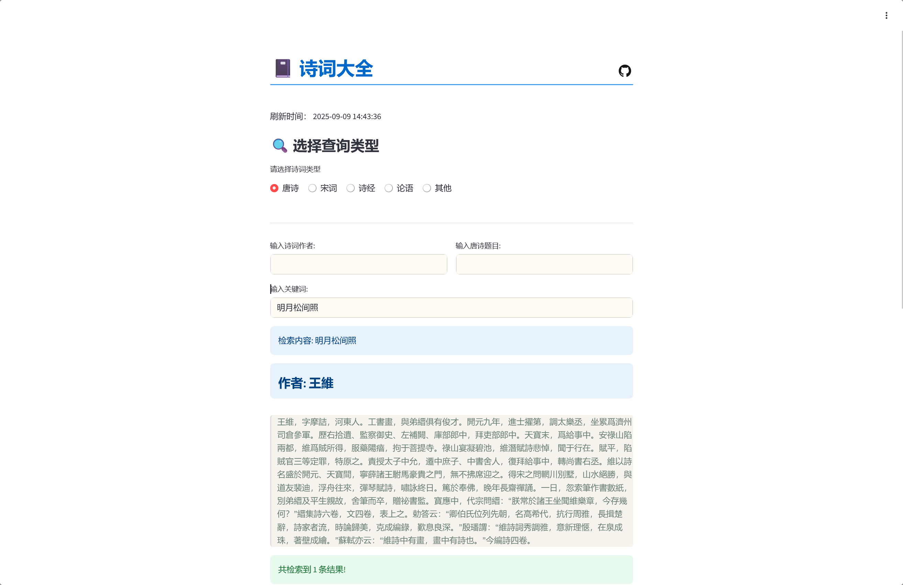

### 一、	背景

> 网上有大佬A已经把唐诗、宋词元曲等数据收集好了，但基本为json格式，大佬B把数据整理成了.sql文件，可导入MySQL数据库。
>
> 某天看电视上回放《诗词大会》，心有所感，都是宝贝，应该把数据用起来才对，数据不能只放在那，得能展示给人看才有用，于是利用Python3的streamlit模块将数据以web形式呈现出来。

---

### 二、	本程序作用

1. 以唐诗（含宋诗）、宋词的作者、题目、诗词关键字等信息及信息组合查询完整的作品，同时会显示相关作者的介绍。
2. 以篇章标题、正文关键字及组合查询诗经、论语的相关章节及全文。
3. 其中唐/宋诗、论语为繁体字，但本程序已经做了简繁转换，可直接通过简体字检索相关信息。

---

### 三、	效果展示




---

### 四、	数据来源

- 原始数据： https://github.com/chinese-poetry/chinese-poetry

- 加工数据：https://github.com/KomaBeyond/chinese-poetry-mysql

---

### 五、	运行方式

#### 5.1	必要步骤：

```shell
### 创建python3虚拟环境
python3 install virtualenv
cd /xxx/xxx
virtualenv pcp
source /xxx/xxx/pcp/bin/activate

### 使用pip方式安装所需模块
pip install streamlit pymysql zhconv

### 可以启动了
streamlit run Chinese-Poetry-Library.py
```

#### 5.2	可选步骤：

```SHELL
### 安装supervisor
......（非重点内容，省略七十一字，可自行搜索）

### 创建supervisor进程配置文件
vim /etc/supervisor/conf.d/supervisor_chinesepoetry.conf
	"""
    [program:Chinese-Poetry]
    command=/xxx/xxx/bin/streamlit run /xxx/xxx/Chinese-Poetry-Library.py --server.port 11118
    autostart=true
    autorestart=true
    startsecs=1
    startretries=3
    stdout_logfile=/xxx/xxx/logs/ChinesePoetry_supervisor.stdout.log
    stderr_logfile=/xxx/xxx/logs/ChinesePoetry_supervisor.stderr.log
    stdout_logfile_maxbytes=20MB
    stdout_logfile_backups=5
	"""

### 加载配置
sudo supervisorctl update
```


---

### 六、	访问方式

- 浏览器访问 http://[域名]或者[IP]:11118 （同时适配手机移动浏览器）

---

### 七、	后记 

1. 首先，非专职程序员，所以程序肯定还有很大改进空间，所以才放出来，欢迎所有人对该程序的功能、性能进一步完善。
2. 最新古籍数据还有许多，比如花间集、四书五经、三百千等蒙学作品，而我个人觉得这些作品都可以有电子版全集，很方便阅读和查询，所以我重点保留了唐/宋诗(311861首)、宋词(21053首)，这些可不好找。
3. 后续还有很多东西可以做，比如：
   - 通过作者简介查询作者姓名及相关作品。
   - 对30+万首作品进行分析，看看常见的山、海、天等字眼分别涉及多少首诗词、统计每个作者的作品数量、风格等，更好地研究先贤。
   - 对作品中的人名、地名等信息进行分析、统计、筛选，看看古人的热门网红打卡地有哪些，绘制足迹点进行研究。
   - 通过作者的生卒年分析每个时期作品中的关注点分别是什么，了解下历史洪流下人名的心路历程。
4. 还有很多很多，一个人就势单力孤了，所以欢迎每个人贡献自己的力量，一起把这些事做下来。
